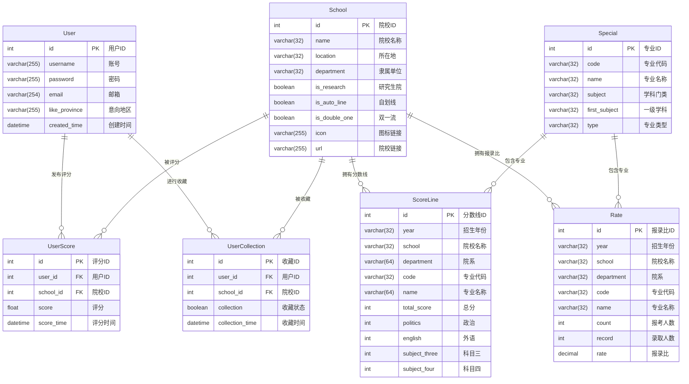

# 考研推荐系统

## 项目介绍
本项目是一个基于Django开发的考研院校推荐系统，提供了院校信息查询、用户评分、个性化推荐、收藏管理等功能，帮助考研学子更高效地选择适合自己的院校。

## 技术栈
- Python 3.x
- Django 2.2.10
- MySQL
- SimpleUI (Django 后台美化)
- 协同过滤推荐算法

## 环境要求
- Python 3.x
- MySQL 5.7+
- pip

## 安装配置步骤

### 1. 克隆项目
```bash
git clone <项目仓库地址>
cd kaoyan
```

### 2. 创建虚拟环境(可选)
```bash
python -m venv venv
# Windows激活
venv\Scripts\activate
# Linux/Mac激活
source venv/bin/activate
```

### 3. 安装依赖
```bash
pip install -r requirements.txt
```

### 4. 数据库配置
在MySQL中创建名为`kaoyan_recommend`的数据库：
```sql
CREATE DATABASE kaoyan_recommend CHARACTER SET utf8mb4 COLLATE utf8mb4_general_ci;
```

项目默认的数据库配置如下(位于`django_exercise/settings.py`):
```python
DATABASES = {
    'default': {
        'ENGINE': 'django.db.backends.mysql',
        'NAME': 'kaoyan_recommend',
        'USER': 'root',
        'PASSWORD': 'root',
        'HOST': '127.0.0.1',
        'PORT': 3306,
    }
}
```

如需修改配置，请更新上述参数以匹配您的MySQL环境。

### 5. 迁移数据库
```bash
python manage.py makemigrations
python manage.py migrate
```

**数据库E-R图：**



### 6. 创建超级用户(可选)

```bash
python manage.py createsuperuser
```

## 运行项目
```bash
python manage.py runserver
```
启动后，访问 http://127.0.0.1:8000 即可使用系统。

管理后台地址: http://127.0.0.1:8000/admin/

## 主要功能模块

### 用户系统
- 用户注册与登录
- 个人信息管理
- 权限控制

### 院校信息
- 院校信息浏览与查询
- 院校详细信息展示

### 推荐系统
- 基于用户的协同过滤推荐
- 随机推荐

### 用户交互
- 用户对院校评分
- 收藏院校管理
- 评分记录查看与管理

## 项目结构
```
kaoyan/
├── app01/               # 主应用目录
│   ├── middleware/      # 中间件
│   ├── migrations/      # 数据库迁移文件
│   ├── models.py        # 数据模型
│   ├── utils/           # 工具函数
│   └── views/           # 视图函数
│       ├── echarts.py   # 图表相关
│       ├── informationSearch.py # 信息搜索
│       ├── login.py     # 登录相关
│       ├── recommend.py # 推荐系统
│       └── user.py      # 用户管理
├── django_exercise/     # 项目配置目录
│   ├── settings.py      # 项目设置
│   ├── urls.py          # URL路由
│   └── wsgi.py          # WSGI配置
└── static/              # 静态文件
```

## 注意事项
- 本项目使用Django的SimpleUI美化后台界面
- 默认语言设置为中文，时区为上海
- 确保MySQL服务正常运行且可连接


